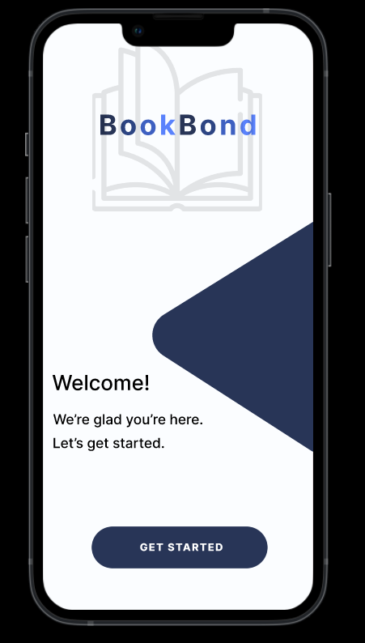

# BookBond Application

  

The main idea is to create an application where book lovers can exchange books based on their interests.

---

## For more information, click [here](https://www.figma.com/file/HbH6t9jSbFZgFjm3f3IgrT/bookbond?type=design&node-id=88%3A9&mode=design&t=5xX0G3hY17LK8e53-1)

---

## How It Works:

When a user downloads the app, they take a quiz on well-known books by tapping (if they like the book) or swiping (if they don’t like the book). This way, they’ll select a genre, and after a few more swipes, the app will match them with another user who has chosen similar books. To continue, the user must place a designated "Box Now" (located near their home) where they’ll be required to send a book to another user who shares the same taste in books. Additionally, the user can select a preferred age range to which they want to send the book, fostering a shared reading experience between age groups.

---

## Google Play Listing

**App Title**: BookBond  
**Category**: Books and Reference  
**Promo Text**: "Your next favorite book is just a TAP away!"

---

## Description

Welcome to BookExchange, the ultimate app for book lovers who want to connect, swap books, and build friendships through their shared love of reading!

- Begin by answering a fun, interactive quiz!
- Based on your answers, you’ll be matched with a unique literary companion and receive book suggestions tailored to your taste.
- Locate a "Box Now" nearby to finalize your book exchange. Simply enter the details into the broader "Box Now" location database.
- Send or receive books effortlessly, directly to and from other book lovers.
- Express yourself with a personal touch by adding a unique note to the book you’re sending.

---

## Key Features

- **Book Selection Quiz**: Helps you define your literary preferences.
- **Matching System**: Connect with other users who share similar reading tastes.
- **Book Exchange without Hassles**: Exchange books easily through the "Box Now" locations.
- **Private Messaging**: Share personal notes to make each exchange memorable.

---

## Usage Scenarios for Different User Groups

### Interactive Quiz:

- The user takes a quiz to identify their interests.
- The app matches them with another user who has similar literary preferences.
- They proceed to the "Box Now" for the book exchange.

---

## Wi-Fi & Data Usage:

Requires Wi-Fi or data access to receive the address of the Box Now location and to notify each user when to send their book.

---

## Teams Members

**Κυριακή Καρατζούνη**  
[st2yp01@gmail.com](https://github.com/korinaak)

**Δώρα Εξάρχου**  
[exarchoudora@gmail.com](https://github.com/DoraExarchou)
